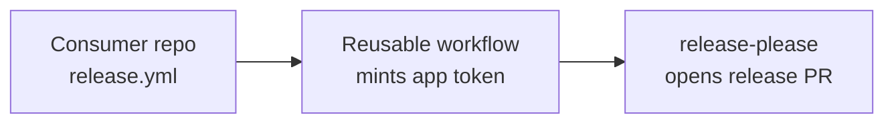

# Release Mate

A [GitHub App](https://github.com/apps/release-mate) that runs
[release-please](https://github.com/googleapis/release-please) on your
repositories without the personal access token sprawl.

Register the app, generate a private key, install it on the repositories that
should release, add a five-line workflow to each, and Release Mate mints a
short-lived, repository-scoped installation token at release time. No shared
PATs, no rotation toil, no account-bound credentials.

## Why

The default release-please workflow uses `GITHUB_TOKEN`, which cannot trigger
downstream workflows from the release commit. Teams work around this by minting
fine-grained personal access tokens — one per repository — and storing them as
secrets. That pattern is painful:

- PATs are bound to a human account; they break when that account leaves the org.
- Fine-grained PATs expire and need rotating per repository.
- A leaked PAT exposes every repository it was scoped to.
- New repositories need new tokens before they can release.

Release Mate replaces every release PAT in your organization with one GitHub
App. Tokens are minted per workflow run, scoped to a single repository, and
expire in roughly an hour.

## How it works

Release Mate is a credential broker, not a service. There is no backend to
host. The app is registered once, installed on the repositories that should
release, and consumed by a reusable workflow that lives in a central tooling
repository.

1. A push to the default branch in a consumer repository triggers `release.yml`.
2. The caller workflow invokes the org's reusable workflow.
3. The reusable workflow exchanges the app's private key for an installation
   token scoped to that one repository.
4. `googleapis/release-please-action` runs with the minted token and opens or
   merges the release pull request.
5. The token expires when the job ends.

## Permissions

Release Mate requests only what release-please needs:

| Scope | Access | Why |
|-------|--------|-----|
| Contents | Read & write | Branches, commits, tags, releases |
| Pull requests | Read & write | Open and update release pull requests |
| Issues | Read & write | Apply labels to release pull requests |
| Workflows | Read & write | Optional — only required if release commits modify `.github/workflows/**` |

The app subscribes to no events and exposes no webhooks.

## Installation

### One-time setup (org admin)

Each organization registers its own GitHub App modelled on the
[reference listing](https://github.com/apps/release-mate). The published
listing exists so you can copy the name, description, and permission shape; the
private key that signs token requests must be one you generate and control.

1. Register the GitHub App on your organization. Set the homepage to your
   tooling repository, leave the callback URL blank, disable webhooks, and
   grant the permissions listed above.
2. Generate a private key and download the `.pem` file.
3. Note the Client ID (visible on the app's settings page).
4. Install the app on the repositories that should release.
5. Store the credentials as **organization secrets**:
   - `RELEASE_MATE_CLIENT_ID`
   - `RELEASE_MATE_PRIVATE_KEY`
